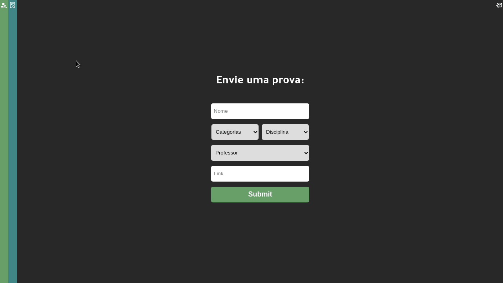

    

  

# repop

O repof é uma aplicação frontend, desenvolvida para enviar e exibir os dados de um repositório público onde estudantes podem compartilhar provas uns com os outros.
Essa aplicação foi feita em par com o o backend, <a href="https://github.com/YoYolops/repop" target="_blank">você pode achá-lo clicando aqui</a>.

  
  
 
 

